# Portals-for-College-events-managments-

## The Setup

- Firstly install MySQL 
- Then install all dependencies: `pip install -r portal/requirements.txt`
- Run the server: `python portal/run.py`
- Open the portal using `http://localhost:5000/admin-portal` in your browser

## The System Implementation

- Mostly Python and JavaScript are used in backend with MySQL queries for database management.
- Flask is used for main application routing and HTML, CSS for frontend.
- Students can register for events, check event details, and give feedback.
- Admin can get analytics and perform all operations on event creation, cancellation, etc.

## Screenshots

### Admin Portal & Management

  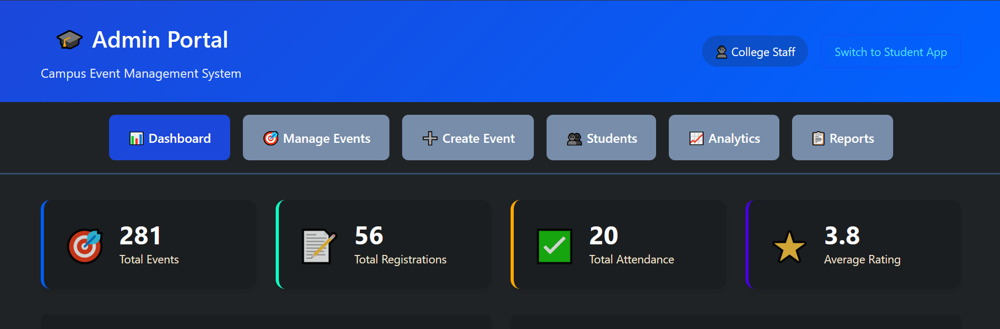

  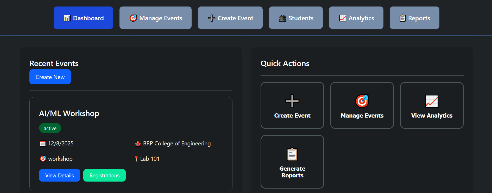

  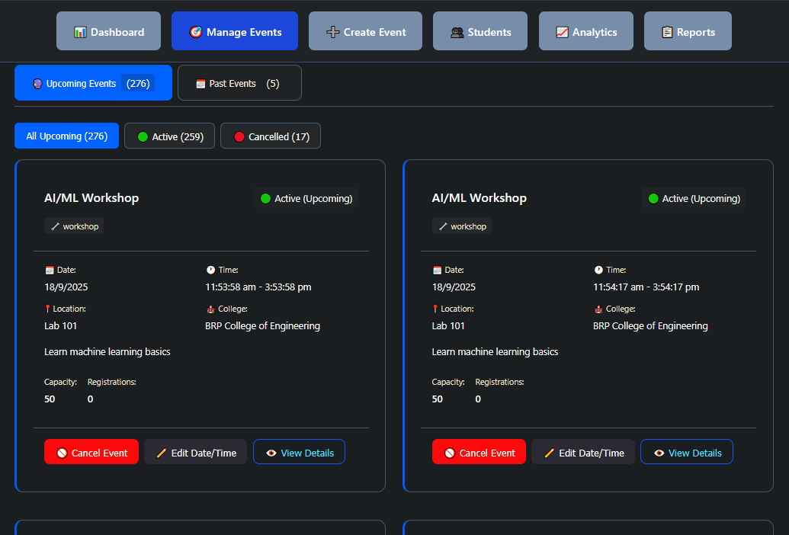

  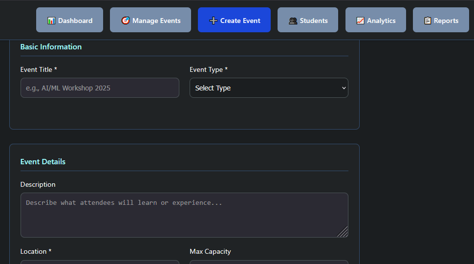

  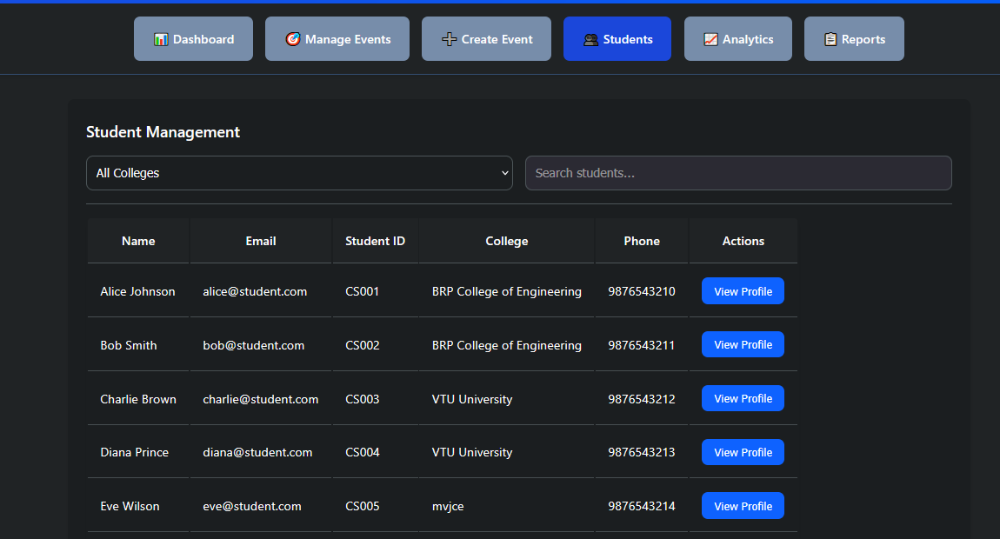

  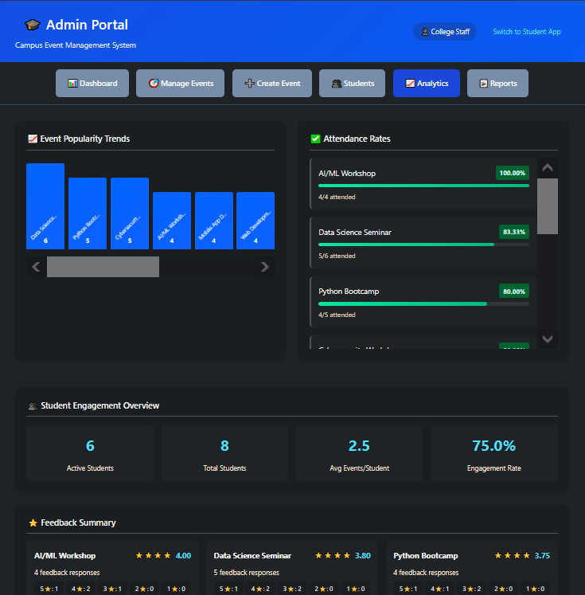

  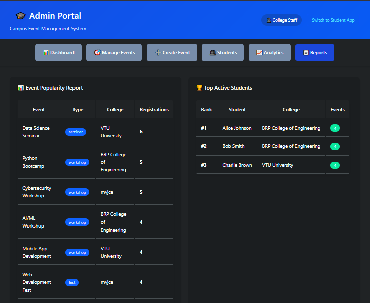

### Student App

  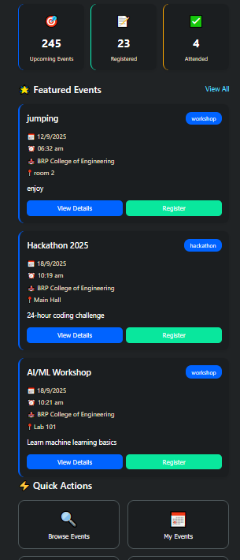
  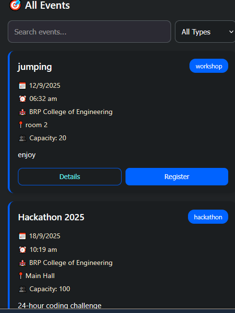
  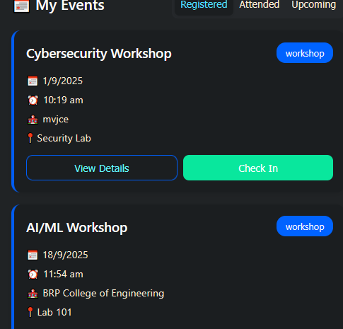
  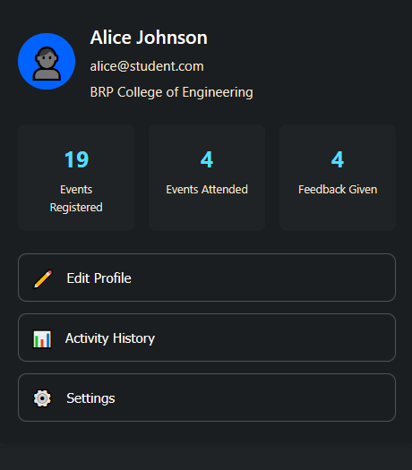

